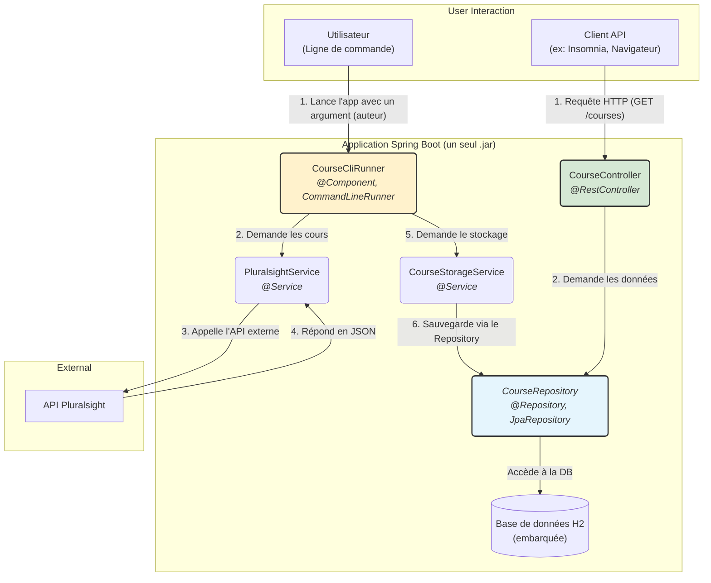

# 📚 Course Info Application (Spring Boot Version)

Bienvenue dans le projet **Course Info** ! Ce projet est une migration de l'application Java EE originale vers **Spring Boot**. Il sert à stocker et à exposer des informations sur des cours, mais avec une architecture plus simple, plus moderne et plus robuste.

## 🏛️ Architecture du Projet

Avec Spring Boot, les trois modules Maven (`cli`, `server`, `repository`) ont été fusionnés en une seule application auto-suffisante. La complexité est réduite grâce à l'**inversion de contrôle (IoC)** et à l'**injection de dépendances (DI)**.



### Les Composants Clés

*   **`CourseCliRunner` (`@Component`)** : Un `CommandLineRunner` qui s'exécute au démarrage de l'application si des arguments sont fournis. Il orchestre la récupération des cours depuis l'API Pluralsight et leur stockage en base de données.
*   **`CourseController` (`@RestController`)** : Expose une API REST pour consulter les cours stockés dans la base de données.
*   **`PluralsightService` et `CourseStorageService` (`@Service`)** : La couche de logique métier. Ces services gèrent respectivement la communication avec l'API externe et la persistance des données.
*   **`CourseRepository` (`JpaRepository`)** : L'interface de la couche de persistance. En étendant `JpaRepository`, Spring Data JPA nous fournit automatiquement les méthodes CRUD (Create, Read, Update, Delete) sans aucune implémentation manuelle (adieu le JDBC !).
*   **`Course` (`@Entity record`)** : Un [Record Java](https://openjdk.java.net/jeps/395) qui sert d'entité JPA, représentant un cours dans la base de données.

## ✨ Les Améliorations apportées par Spring Boot

Ce projet met en pratique les pistes d'amélioration suggérées dans la version Java EE :

*   ✅ **Injection de Dépendances (DI)** : Fini les `new MyService()` ! Spring gère le cycle de vie des composants (`@Service`, `@Repository`, etc.) et les injecte là où c'est nécessaire (par exemple, dans les constructeurs). Le code est plus simple et plus facile à tester.

*   ✅ **Externalisation de la Configuration** : Les configurations, comme l'URL de l'API Pluralsight, sont externalisées dans `src/main/resources/application.properties`. L'annotation `@Value` est utilisée pour les injecter dans les composants.

*   ✅ **Gestion des Transactions** : La méthode `storePluralsightCourses` est annotée avec `@Transactional`. Cela garantit que la sauvegarde de la liste des cours est **atomique** : soit tous les cours sont sauvegardés, soit aucun en cas d'erreur.

*   ✅ **Simplicité et Convention** : Plus besoin de configurer manuellement un serveur web (Tomcat est embarqué), de gérer les librairies de bas niveau (JDBC, JSON) ou de créer des implémentations de repository. Spring Boot s'occupe de tout.

## 🛠️ Technologies Utilisées

*   **Framework :** Spring Boot 3
*   **Langage :** Java 21
*   **Système de Build :** Apache Maven
*   **API REST :** Spring Web (MVC)
*   **Accès aux Données :** Spring Data JPA & Hibernate
*   **Base de Données :** H2 (embarquée)
*   **Appels Web :** `RestTemplate` de Spring

## 🚀 Démarrage

1.  **Configurer l'application :**
    Assurez-vous que le fichier `src/main/resources/application.properties` contient l'URL de base de l'API Pluralsight :
    ```properties
    pluralsight.api.base-url=https://app.pluralsight.com
    ```

2.  **Compiler et packager le projet :**
    ```bash
    mvn clean package
    ```

3.  **Remplir la base de données (mode CLI) :**
    Exécutez le JAR généré en passant un ID d'auteur Pluralsight en argument.
    ```bash
    # Remplacer {author-id} par un ID d'auteur (ex: sander-mak)
    java -jar target/course-info-springboot-1.0-SNAPSHOT.jar {author-id}
    ```
    L'application va récupérer les cours, les stocker, puis s'arrêter.

4.  **Démarrer le serveur web :**
    Exécutez le même JAR, mais **sans argument**.
    ```bash
    java -jar target/course-info-springboot-1.0-SNAPSHOT.jar
    ```

5.  **Consulter les cours :**
    Ouvrez votre navigateur ou un client API à l'adresse `http://localhost:8080/courses`. Vous devriez voir la liste des cours au format JSON.
